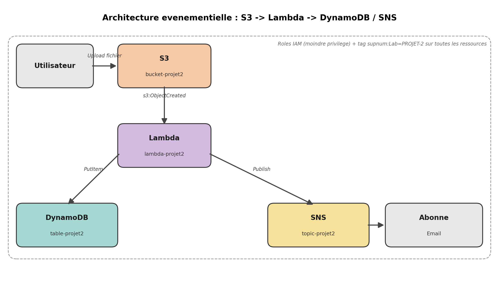

# PROJET-2 : Pipeline evenementiel S3 -> Lambda -> DynamoDB -> SNS

**Groupe :** GROUP-22035-22067-22087
**Cours :** Architecture Cloud Avancee (IaaS, PaaS) 2026
**Date limite :** 07 juillet 2026

## Description

Pipeline de traitement de donnees sans serveur : le depot d'un fichier dans un
bucket S3 declenche une fonction Lambda qui extrait les metadonnees du fichier,
les enregistre dans une table DynamoDB, puis publie une notification de succes
via un topic SNS vers un abonne (email).

Toute l'infrastructure est definie en **Infrastructure as Code** avec
**AWS CloudFormation** (`infrastructure/template.yaml`).

## Architecture



**Flux :**
1. Un fichier est depose dans le bucket S3 (`bucket-projet2`)
2. L'evenement `s3:ObjectCreated` declenche automatiquement la fonction Lambda
   (`lambda-projet2`)
3. La Lambda extrait les metadonnees (nom, taille, date) et les ecrit dans la
   table DynamoDB (`table-projet2`)
4. La Lambda publie un message sur le topic SNS (`topic-projet2`)
5. L'abonne recoit la notification par email

## Services AWS utilises et justification

| Service | Role | Pourquoi ce choix |
|---|---|---|
| **S3** | Stockage des fichiers uploades, source de l'evenement declencheur | Stockage objet durable, integration native avec Lambda via notifications d'evenements |
| **Lambda** | Traitement serverless a la volee | Pas de serveur a gerer, facturation a l'usage, scalabilite automatique |
| **DynamoDB** | Stockage des metadonnees extraites | Base NoSQL serverless, latence faible, mode `PAY_PER_REQUEST` adapte a un trafic imprevisible |
| **SNS** | Notification de succes vers un abonne | Service de messagerie pub/sub managed, supporte email/SMS sans infrastructure dediee |
| **IAM** | Controle d'acces entre les services | Application du principe de moindre privilege |

## Roles IAM et securite

Le role d'execution Lambda (`RoleLambda`) applique le **principe du moindre
privilege** : chaque permission est restreinte a la ressource exacte dont
Lambda a besoin, sans aucun acces generique (`*`) :

- `s3:GetObject` limite a `arn:aws:s3:::bucket-projet2/*` (ce bucket uniquement)
- `dynamodb:PutItem` limite a l'ARN exact de la table `table-projet2`
- `sns:Publish` limite a l'ARN exact du topic `topic-projet2`
- Permissions de logs CloudWatch via la policy managee AWS standard
  (`AWSLambdaBasicExecutionRole`)

La permission `PermissionS3` restreint explicitement l'invocation de la Lambda
au seul bucket du projet (`SourceArn`), empechant tout autre service ou compte
d'invoquer la fonction.

## Optimisation des couts

- **100 % serverless** : aucune ressource ne tourne en continu (pas d'EC2, pas
  de instance provisionnee en permanence)
- **DynamoDB en mode `PAY_PER_REQUEST`** : pas de capacite provisionnee inutilement,
  facturation uniquement a la lecture/ecriture reelle
- **Lambda dimensionnee au minimum** : 128 Mo de memoire, largement suffisant
  pour une extraction de metadonnees, timeout de 30 secondes
- **SNS et S3** : facturation uniquement a l'usage (nombre de notifications,
  volume stocke)
- Estimation : cout quasi nul pour un usage de test/demonstration (quelques
  centimes maximum sur la duree du projet)
- Le stack sera supprime (`aws cloudformation delete-stack`) apres la
  soutenance pour eviter toute ressource residuelle

## Tags

Toutes les ressources sont taguees avec `supnum:Lab = PROJET-2`.

> **Note :** le tag `supnum:Group = GROUP-22035-22067-22087` n'a pas pu etre
> applique. Une Tag Policy AWS Organizations active sur le compte rejette
> systematiquement toute valeur testee pour la cle `supnum:Group` (testé avec
> la valeur de l'enonce, une variante sans prefixe, et une valeur arbitraire —
> voir captures d'ecran `docs/screenshots/erreur-tag-policy-*.png`). Le
> probleme a ete signale au professeur ; il s'agit d'une contrainte du compte
> AWS partage, independante du template CloudFormation.

## Structure du depot

```
.
├── README.md
├── infrastructure/
│   └── template.yaml          # Template CloudFormation complet
├── lambda/
│   └── lambda_function.py     # Code Lambda (extraction + DynamoDB + SNS)
└── docs/
    ├── architecture-diagram.png
    └── screenshots/
        ├── s3-upload.png
        ├── cloudwatch-logs.png
        ├── dynamodb-item.png
        ├── sns-email.png
        └── erreur-tag-policy-1.png (et suivants)
```

## Deploiement

```bash
aws cloudformation deploy \
  --template-file infrastructure/template.yaml \
  --stack-name Projet2-Groupe \
  --parameter-overrides NotificationEmail="votre@email.com" \
  --capabilities CAPABILITY_NAMED_IAM
```

## Test du pipeline

1. Deposer un fichier dans le bucket S3 :
   ```bash
   aws s3 cp test.txt s3://bucket-projet2/
   ```
2. Verifier les logs d'execution dans CloudWatch (Lambda `lambda-projet2`)
3. Verifier la ligne creee dans DynamoDB (`table-projet2`, item `id = test.txt`)
4. Verifier la reception de l'email de notification

## Nettoyage apres la soutenance

```bash
aws cloudformation delete-stack --stack-name Projet2-Groupe
```

## Declaration sur l'utilisation de l'IA

*(a completer par l'equipe selon les modalites confirmees avec le professeur
concernant l'usage tolere d'outils IA pour la comprehension/le debogage vs. la
generation directe du code final)*